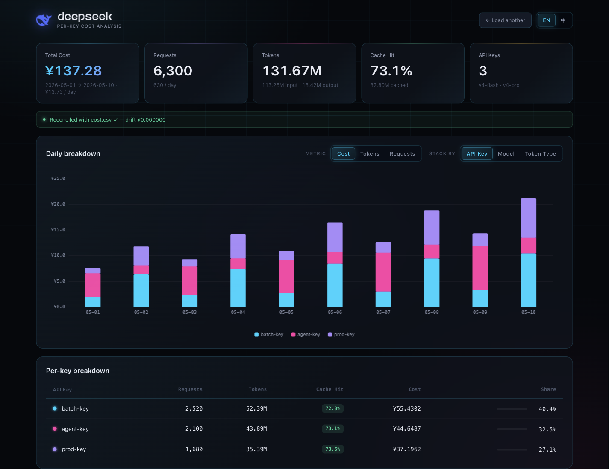

# DeepSeek Usage Calculator

A single-file, self-contained, browser-based dashboard for analyzing DeepSeek API usage exports. Drop in a DeepSeek `usage_data_*.zip` package and the page computes cost, token volume, request volume, cache hit rate, per-key spend, daily trends, and pricing reconciliation entirely in your browser.



## Features

- Drag-and-drop analysis for DeepSeek usage export zips.
- Per-key summary table with request, token, cache-hit, cost, and spend-share breakdowns.
- Daily stacked chart by API key, model, or token type.
- Metric toggle for cost, tokens, and requests.
- Built-in English and 中文 interface.
- Editable DeepSeek pricing table with temporary or persisted defaults.
- Cost reconciliation against `cost-*.csv`.
- Fully client-side processing. Usage files are not uploaded anywhere.

## Quick Start

Open `index.html` directly in a browser, then drop your DeepSeek usage zip onto the upload area.

> Example: `usage_data_2026_5.zip`, downloaded from https://platform.deepseek.com/usage

The app is designed to work as a self-contained HTML file. The supporting JavaScript libraries and DeepSeek logo artwork are embedded in `index.html`, so no build step or local server is required for normal use.

## Expected Input

The zip should contain one amount CSV and one cost CSV:

```text
usage_data_*.zip
├── amount-*.csv
└── cost-*.csv
```

The amount CSV is expected to include these fields:

```text
utc_date, model, api_key_name, type, amount, price
```

Recognized `type` values:

```text
request_count
input_cache_hit_tokens
input_cache_miss_tokens
output_tokens
```

The cost CSV is expected to include a `cost` field. The app sums `cost-*.csv` and compares it with the computed total from `amount-*.csv`.

## Pricing

Default prices are embedded for:

- `deepseek-v4-flash`
- `deepseek-v4-pro`

Prices are represented internally as CNY per token and shown in the UI as CNY per 1M tokens.

Use the pricing table controls to:

- `Edit`: change prices for the current session.
- `Save`: apply edited prices until the page is reloaded.
- `Save to default`: persist edited prices in browser `localStorage`.
- `Default`: restore the embedded default prices and clear saved pricing.

When pricing differs from the embedded defaults, the reconciliation banner switches to a modified-pricing state so computed cost is not mistaken for billed cost.

## Privacy

All parsing and visualization happens locally in the browser. The app does not send your usage data to a server.

Notes:

- Saved pricing uses browser `localStorage`.
- `localStorage` is scoped by browser and origin. Opening the file directly and opening it through `localhost` are treated as different origins.
- Zip files are ignored by git through `.gitignore`.

## Optional Local Server (not necessary)

Directly opening `index.html` is the preferred workflow. If you want a local HTTP origin for testing, run:

```bash
python3 -m http.server 8001
```

Then open:

```text
http://127.0.0.1:8001/
```

## Repository Layout

```text
.
├── DS-Calculator.html  # Self-contained calculator app
├── assets				# assets used to build
├── docs				# documents
└── README.md
```

`index.html` does not require the SVG files at runtime; the current logo artwork is embedded inline.

## Limitations

- Pricing can change. Verify current DeepSeek pricing before using this for accounting decisions.
- The app assumes the DeepSeek export CSV column names and token type names listed above.
- Very large exports are parsed in the browser, so performance depends on local browser memory and CPU.

## Reference

Fonts are referenced from: https://api-docs.deepseek.com/

## License

No license has been declared for this repository yet.
